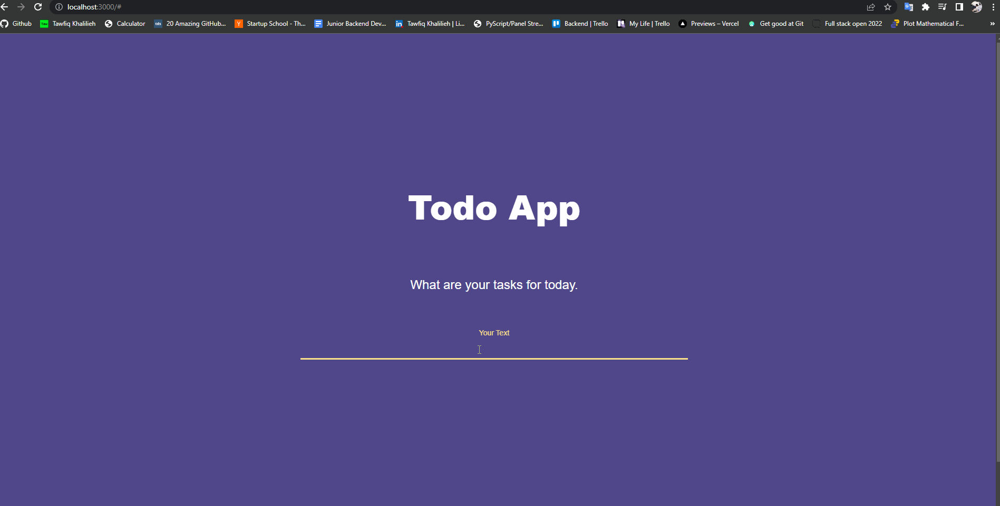

## Todo App built with Next 🚀



First, install the required packages and run the development server:

```bash
npm i && npm run dev
# or
yarn && yarn dev
```

### Techs:

- Next.js
- React.js
- Typescript
- Sass ( SCSS )
